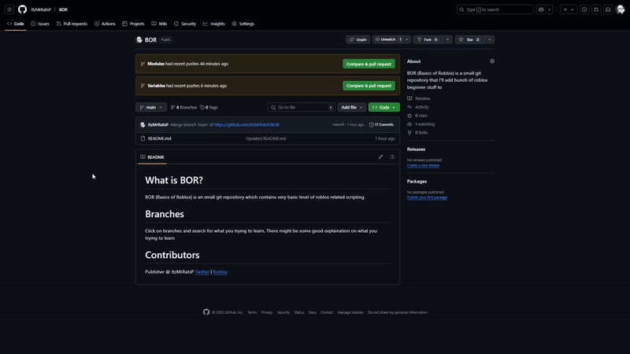

# What is BOR?
BOR (Basics of Roblox) is an small git repository which contains very basic level of roblox related scripting.

# Branches
Click on branches and search for what you trying to learn, There might be some good explaination on what you trying to learn\n

# Contributors
Publisher @ ItzMrRatsP [Twitter](https://x.com/ItzMrRatsP) | [Roblox](roblox.com/users/2536605621/profile)